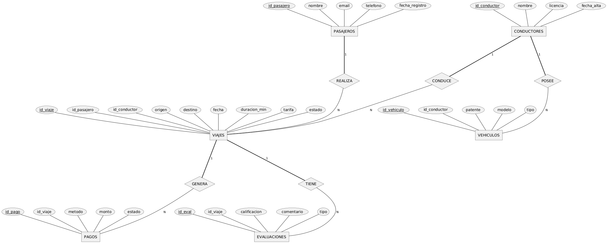

# Notas de Diseño del Proyecto

Este documento resume el diseño conceptual y lógico de la base de datos **movilidad_urbana**.  
El objetivo es dejar claramente documentada la estructura de entidades, relaciones y restricciones principales.

---

## 📂 Estructura del Proyecto

```
┣ 01_Modelo
┃ ┗ Notas_Diseño.md
┣ 02_SQL
┃ ┣ 01_creacion_tablas.sql
┃ ┣ 02_insercion_datos.sql
┃ ┣ 03_consultas.sql
┃ ┣ 04_vistas.sql
┃ ┗ 05_indices_extras.sql
┣ 03_Documentacion
┃ ┣ Capturas_Resultados
┃ ┗ README.md
┣ 04_Extras
┃ ┣ Datos_Prueba.csv
┃ ┗ Script_Completo.sql
┗ img
 ┗ chen.png
```

---

## 📊 Modelo Entidad-Relación

El siguiente diagrama en notación **Chen** representa cómo se encuentra estructurada la base de datos:



---

## 📝 Notas Importantes

- **01_Modelo** contiene este documento de diseño.  
- **02_SQL** incluye los scripts de creación, inserción, consultas, vistas e índices adicionales.  
- **03_Documentacion** centraliza capturas y un README explicativo.  
- **04_Extras** guarda datos de prueba y un script completo para ejecución integral.  
- **img** almacena el diagrama conceptual en formato PNG.  

---

## ✅ Conclusión

Este diseño busca mantener la **claridad**, **modularidad** y **reproducibilidad** del proyecto, facilitando tanto la comprensión académica como la implementación práctica.